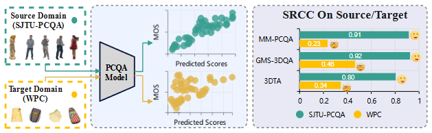

# UPDA-main

This is the official project  repository containing the implementation Code for UPDA: Unsupervised Progressive Domain Adaptation for No-Reference Point Cloud Quality Assessment by Bingxu Xie, Jincan Wu, Yonghui Liu, Weiqing Li, and Zhiyong Su

Our paper addresses the issue of the distribution shift across various point cloud quality databases and proposes methods to to improve the generalization performance of existing PCQA models.

### Abstract

While no-reference point cloud quality assessment (NR-PCQA) approaches have achieved significant progress over the past decade, their performance often degrades substantially when a distribution gap exists between the training (source domain) and testing (target domain) data. 
However, to date, limited attention has been paid to transferring NR-PCQA models across domains.
To address this challenge, we propose the first unsupervised progressive domain adaptation (UPDA) framework for NR-PCQA, which establishes a coarse-to-fine alignment paradigm. 
At the coarse-grained stage, a discrepancy-based coarse-grained ranking alignment method is designed to capture relative quality relationships between cross-domain samples through a combined ranking loss and maximum mean discrepancy (MMD) loss, circumventing the challenges of direct absolute feature alignment. 
At the fine-grained stage,  an adversarial-based fine-grained fusion alignment approach with cross-attention mechanism is developed to identify domain-invariant features, while a conditional discriminator selectively enhances quality-relevant feature transfer.
Extensive experiments demonstrate that the proposed UPDA effectively enhances the performance of NR-PCQA methods in cross-domain scenarios, validating its practical applicability.

### Framework

### **Datasets**

 SJTU-PCQA: [Predicting the Perceptual Quality of Point Cloud: A 3D-to-2D Projection-Based Exploration](https://ieeexplore.ieee.org/abstract/document/9238424) | [Link](https://smt.sjtu.edu.cn/database/)                                                                            

WPC: [Perceptual Quality Assessment of Colored 3D Point Clouds](https://ieeexplore.ieee.org/document/9756929)  | [Link](https://github.com/qdushl/Waterloo-Point-Cloud-Database)  

WPC2.0(Compression): [Reduced Reference Perceptual Quality Model with Application to Rate Control for Video-based Point Cloud Compression](https://ieeexplore.ieee.org/document/9490512) | [Link](https://github.com/qdushl/Waterloo-Point-Cloud-Database-2.0)     

​                                           

### **Run Code for Different Models**

#### Environment

We train and test the code on the Ubuntu 20.04 platform with pytorch=1.13. The GPU is 4090 with 24 GB memory.

#### Begin training

1. `python _{PCQA}_step1.py`
2. `python _{PCQA}_step2.py`
